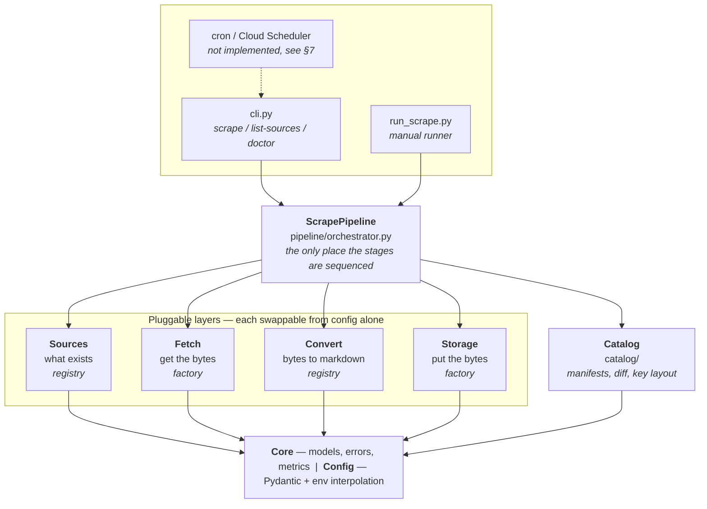
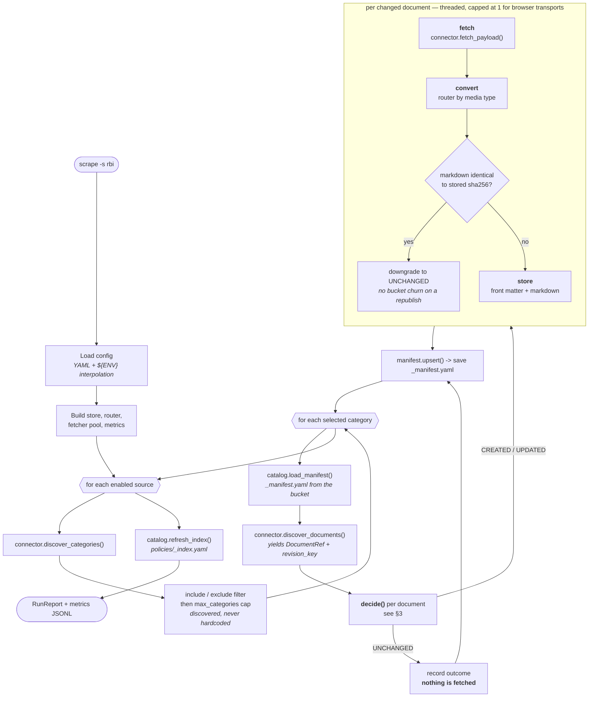
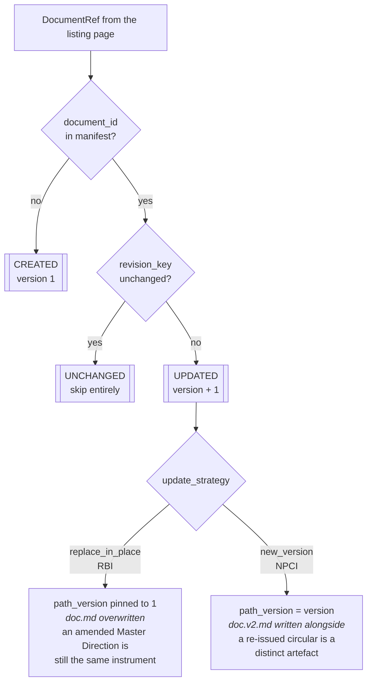
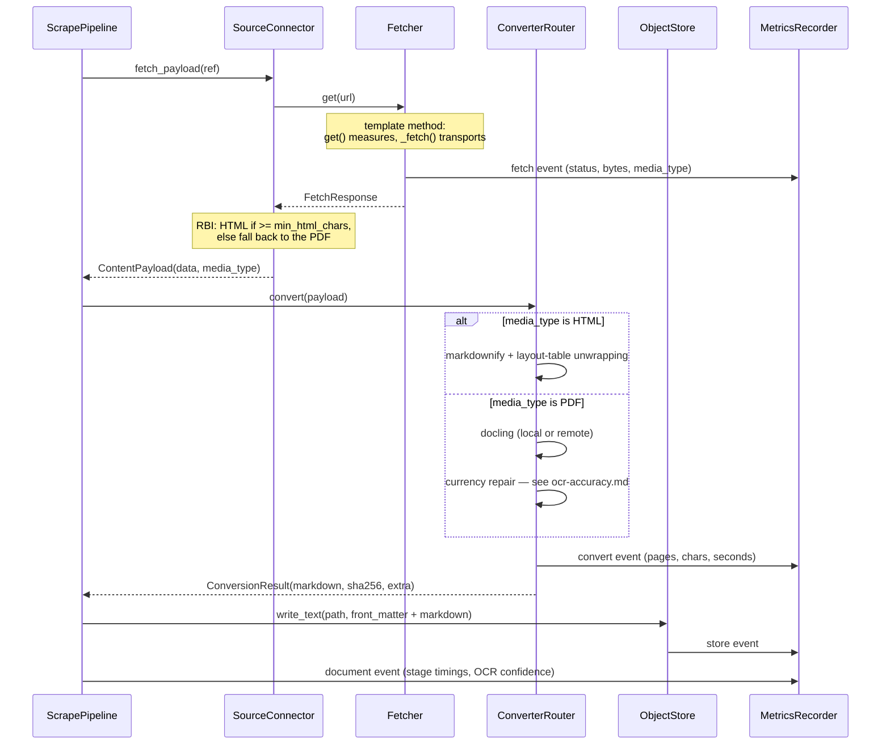

# Architecture

How the scraper is put together and what happens during a run.

The shape of the system follows from one constraint: **everything expensive
happens after the change-detection step.** A re-run over an unchanged source
costs one listing page per source and nothing else — no downloads, no OCR, no
writes. Most of the design below exists to make that true and to keep it true
as sources are added.

---

## 1. Layers

Dependencies point downward only. Nothing in a lower layer knows about a
layer above it, which is why a new source or a new storage backend is an
addition rather than an edit.



Plain-text equivalent:

```
  cli.py / run_scrape.py            <- entry points
          |
  ScrapePipeline                    <- sequences the stages, owns nothing else
          |
  +-------+--------+---------+--------+
  |       |        |         |        |
Sources  Fetch  Convert  Storage   Catalog
  |       |        |         |        |
  +-------+--------+---------+--------+
          |
   core/ (models, errors, metrics) + config/
```

---

## 2. The run, end to end



Every stage boundary in that diagram emits a metrics event. That is what
`tools/analyze_metrics.py` reads — see [metrics.md](metrics.md).

---

## 3. Change detection

This is the heart of the incremental promise. It runs on listing-page data
only, before anything is downloaded.



`revision_key` is built by each connector from signals already on the listing
page, so detecting a change never costs a download:

| Source | Signal |
|---|---|
| RBI | PDF filename embeds a content hash, plus `(Updated as on <date>)` in the title |
| NPCI | Strapi upload URL carries a content-hash suffix (`..._e695625b85.pdf`) |

Two things worth noting, because both were deliberate:

- **`version` and `path_version` are different numbers.** `version` always
  counts how many times a document has changed and goes in the manifest;
  `path_version` only selects the object key. Under `replace_in_place` it is
  pinned to 1 so consumers always resolve current text at one stable address.
- **A content re-check happens after conversion.** If the listing signal moved
  but the markdown hashes identically, the document is downgraded back to
  UNCHANGED. A cosmetic republish does not bump the version or churn the
  bucket.

---

## 4. Per-document detail



The fetch measurement point is worth calling out. `Fetcher.get()` is concrete
and times the request; subclasses implement only `_fetch()`. Adding a
transport therefore cannot forget to report itself, and no transport needs to
know metrics exist.

---

## 5. What the bucket looks like

All keys come from `catalog/layout.py` — one place, so the layout can be
changed without hunting through the codebase. The local backend uses an
identical key structure, so a GCS switch is config only.

```
policies/                                     <- storage.root_prefix
├── _index.yaml                               <- roll-up of every manifest
├── rbi/
│   ├── commercial-banks/
│   │   ├── _manifest.yaml                    <- metadata for every doc below
│   │   └── documents/
│   │       └── reserve-bank-...-rbi-md-13271.md
│   └── consumer-education-and-protection/
│       ├── _manifest.yaml
│       └── documents/…
└── npci/
    └── upi/
        ├── _manifest.yaml
        └── documents/
            ├── upi-oc-186a.md
            └── upi-oc-186a.v2.md             <- NEW_VERSION keeps both
```

Metadata lives at three levels, each answering a different question:

| Level | File | Answers |
|---|---|---|
| Bucket | `_index.yaml` | what categories exist, where their manifests are |
| Category | `_manifest.yaml` | what documents exist, their revision keys and hashes |
| Document | YAML front matter in the `.md` | provenance for this one file, travels with it |

Front matter travelling *inside* the markdown matters for the downstream
agent: a retrieved chunk carries its own source URL, version and retrieval
date without a lookup.

---

## 6. Extension points

Adding a site touches one new file and one config block. Nothing else.

| Point | Mechanism | Add by |
|---|---|---|
| Source | `source_registry` | subclass `SourceConnector`, decorate with `@source_registry.register("x.y")` |
| Fetcher | `build_fetcher()` | subclass `Fetcher`, implement `_fetch()` |
| Converter | `converter_registry` | subclass `DocumentConverter` |
| Storage | `build_object_store()` | subclass `ObjectStore` |

A connector answers exactly three questions, and nothing about transport,
conversion or storage:

```python
discover_categories() -> list[Category]          # what sections exist
discover_documents(category) -> Iterable[DocumentRef]   # what documents, + revision_key
fetch_payload(ref) -> ContentPayload             # the bytes, and what they are
```

Per-source choices that are config, not code:

| | RBI | NPCI |
|---|---|---|
| Transport | `http` — server-rendered HTML, a browser would be pure overhead | `browser` — Akamai returns 403 to every non-browser client |
| Content | HTML detail pages, PDF fallback below `min_html_chars` | scanned PDFs, no text layer |
| Conversion | markdownify — lossless, no OCR | docling + OCR + currency repair |
| Update strategy | `replace_in_place` | `new_version` |
| Cost profile | ~93% fetch, ~7% convert | ~1% fetch, ~99% convert |

That last row is measured, and it says where optimisation effort pays: for
NPCI only OCR speed matters; for RBI only request latency does.

---

## 7. Scheduling

The cron job is deliberately not implemented, but the pipeline is shaped for
it: a run is a single idempotent command whose cost is proportional to what
actually changed, and whose exit code reflects the outcome.

```bash
scrape --config config/sources.yaml            # all enabled sources
scrape -s rbi                                  # one source
```

Anything that can invoke that on a timer works — cron, systemd timer, Cloud
Scheduler → Cloud Run Job, Airflow. No state is held between runs outside the
bucket itself, so concurrent or retried runs converge rather than conflict.

---

## 8. Cross-cutting concerns

**Failure isolation.** `continue_on_error` is on by default. One bad document
is recorded as `FAILED` in the report and the run proceeds; a failing category
does not abort its source. The alternative — losing 40 good documents to one
malformed PDF — is worse for a nightly job.

**Metrics never break a scrape.** `MetricsRecorder` catches every exception on
write, disables itself once, and logs a warning. A full disk degrades
observability, not the run.

**Accuracy.** No OCR engine tested reads the `₹` glyph. The pipeline repairs
what is unambiguous, substitutes-with-audit what is plausible, and *flags
without rewriting* what cannot be recovered — the counts ride into both the
front matter and the metrics file. Full detail and the measurements behind the
engine choice are in [ocr-accuracy.md](ocr-accuracy.md).
